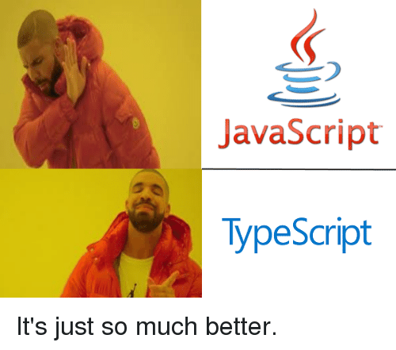

# 0x04. Typescript
| `JavaScript` | `TypeScript` |



## Resources
**Read or watch:**

- [TypeScript in 5 minutes](https://intranet.alxswe.com/rltoken/waTSa9Mguj912pel9On57w)
- [TypeScript documentation](https://intranet.alxswe.com/rltoken/iPO8DlHCGzc1jnojLoP9HA)

## Learning Objectives
At the end of this project, you are expected to be able to explain to anyone, without the help of Google:

- Basic types in Typescript
- Interfaces, Classes, and functions
- How to work with the DOM and Typescript
- Generic types
- How to use namespaces
- How to merge declarations
- How to use an ambient Namespace to import an external library
- Basic nominal typing with Typescript

## Requirements
- Allowed editors: `vi`, `vim`, `emacs`, `Visual Studio Code`
- All your files should end with a new line
- All your files will be transpiled on Ubuntu 18.04
- Your TS scripts will be checked with `jest` (version 24.9.* )
- A `README.md` file, at the root of the folder of the project, - is mandatory
- Your code should use the `ts` extension when possible
- The Typescript compiler should not show any warning or error when compiling your code

## Configuration Files
Please use these files for the following tasks

**`Package.json`**

```json
{
  "name": "typescript_dependencies",
  "version": "1.0.0",
  "description": "",
  "main": "index.js",
  "scripts": {
    "start-dev": "webpack-dev-server --open",
    "build": "webpack",
    "test": "jest"
  },
  "keywords": [],
  "author": "",
  "license": "ISC",
  "devDependencies": {
    "@babel/plugin-proposal-export-default-from": "^7.5.2",
    "@babel/preset-typescript": "^7.7.2",
    "@types/jest": "^24.0.23",
    "@typescript-eslint/eslint-plugin": "^2.4.0",
    "@typescript-eslint/parser": "^2.4.0",
    "clean-webpack-plugin": "^3.0.0",
    "fork-ts-checker-webpack-plugin": "^1.5.1",
    "html-webpack-plugin": "^3.2.0",
    "jest": "^24.9.0",
    "source-map": "^0.7.3",
    "ts-jest": "^24.1.0",
    "ts-loader": "^6.2.0",
    "typescript": "^3.6.4",
    "webpack": "^4.41.2",
    "webpack-cli": "^3.3.9",
    "webpack-dev-server": "^3.8.2"
  }
}
```

**`.eslintrc.js`**

```js
module.exports =  {
  parser:  '@typescript-eslint/parser',
  extends:  [
    'plugin:@typescript-eslint/recommended',  // Uses the recommended rules from @typescript-eslint/eslint-plugin
  ],
  parserOptions:  {
    ecmaVersion:  2018,
    sourceType:  'module',
  },
  rules:  {
  },
};

```

**`tsconfig.json`**

```json
{
  "compilerOptions": {
    "outDir": "./dist/",
    "sourceMap": true,
    "noImplicitAny": true,
    "module": "es6",
    "target": "es5",
    "allowJs": true,
    "moduleResolution": "node"
  }
}
```

**`webpack.config.js`**

```js
const path = require("path");
const HtmlWebpackPlugin = require('html-webpack-plugin');
const { CleanWebpackPlugin } = require('clean-webpack-plugin');
const ForkTsCheckerWebpackPlugin = require('fork-ts-checker-webpack-plugin');

module.exports = {
  entry: "./js/main.ts",
  devtool: "inline-source-map",
  module: {
    rules: [
      {
        test: /\.tsx?$/,
        loader: 'ts-loader',
        options: {
          transpileOnly: true
        }
      }
    ]
  },
  resolve: {
    extensions: [".tsx", ".ts", ".js"]
  },
  devServer: {
    contentBase: "./dist"
  },
  plugins: [
    new ForkTsCheckerWebpackPlugin(),
    new CleanWebpackPlugin(),
    new HtmlWebpackPlugin({
      title: "Development"
    })
  ],
  output: {
    filename: "bundle.js",
    path: path.resolve(__dirname, "dist")
  }
};
```

## Tasks
### 0. Creating an interface for a student

Copy the following configuration files (provided above) into the `task_0` directory: `package.json`, `.eslintrc.js`, `tsconfig.json`, `webpack.config.js`

Write your code in the `main.ts` file:

- Write an interface named Student that accepts the following elements: `firstName`(string), `lastName`(string), `age`(number), and `location`(string)
- Create two students, and create an array named `studentsList` containing the two variables
- Using Vanilla Javascript, render a table and for each elements in the array, append a new row to the table
- Each row should contain the first name of the student and the location

Requirements:

- When running, Webpack should return No type errors found.
- Every variable should use TypeScript when possible.

### 1. Let's build a Teacher interface

Create a directory `task_1` and copy these configuration files into this folder: `package.json`, `tsconfig.json`, `webpack.config.js`

- `firstName(string)` and `lastName(string)`. These two attributes should only be modifiable when a Teacher is first initialized
- `fullTimeEmployee(boolean)` this attribute should always be defined
- `yearsOfExperience(number)` this attribute is optional
- `location(string)` this attribute should always be defined
Add the possibility to add any attribute to the Object like `contract(boolean)` without specifying the name of the attribute

Example:

```ts
const teacher3: Teacher = {
  firstName: 'John',
  fullTimeEmployee: false,
  lastName: 'Doe',
  location: 'London',
  contract: false,
};

console.log(teacher3);

// should print
// Object
// contract: false
// firstName: "John"
// fullTimeEmployee: false
// lastName: "Doe"
// location: "London"
```

### 2. Extending the Teacher class

Write an interface named `Directors` that extends `Teacher`. It requires an attribute named `numberOfReports(number)`

Example:

```ts
const director1: Directors = {
  firstName: 'John',
  lastName: 'Doe',
  location: 'London',
  fullTimeEmployee: true,
  numberOfReports: 17,
};
console.log(director1);

// should print
// Object
// firstName: "John"
// fullTimeEmployee: true
// lastName: "Doe"
// location: "London"
// numberOfReports: 17
```

### 3. Printing teachers

Write a function `printTeacher`:

- It accepts two arguments `firstName` and `lastName`
- It returns the first letter of the firstName and the full lastName
- Example: `printTeacher("John", "Doe") -> J. Doe`
Write an interface for the function named `printTeacherFunction`.

### 4. Writing a class

Write a Class named `StudentClass`:

- The constructor accepts `firstName(string)` and `lastName(string)` arguments
- The class has a method named `workOnHomework` that return the string `Currently working`
- The class has a method named `displayName`. It returns the firstName of the student
- The constructor of the class should be described through an Interface
- The class should be described through an Interface

Requirements:

- You can reuse the Webpack configuration from the previous exercise to compile the code.
- When running `npm run build`, no TypeScript error should be displayed.
- Every variable should use TypeScript when possible.

### 5. Advanced types Part 1

Create the `DirectorInterface` interface with the 3 expected methods:

- `workFromHome()` returning a string
- `getCoffeeBreak()` returning a string
- `workDirectorTasks()` returning a string

Create the `TeacherInterface` interface with the 3 expected methods:

- `workFromHome()` returning a string
- `getCoffeeBreak()` returning a string
- `workDirectorTasks()` returning a string

Create a class `Director` that will implement `DirectorInterface`

- `workFromHome` should return the string `Working from home`
- `getToWork` should return the string `Getting a coffee break`
- `workDirectorTasks` should return the string `Getting to director tasks`

Create a class `Teacher` that will implement `TeacherInterface`

- `workFromHome` should return the string `Cannot work from home`
- `getCoffeeBreak` should return the string `Cannot have a break`
- `workTeacherTasks` should return the string `Getting to work`

Create a function `createEmployee` with the following requirements:

- It can return either a `Director` or a `Teacher` instance
- It accepts 1 arguments:
  - `salary`(either number or string)
- if `salary` is a number and less than 500 - It should return a new `Teacher`. Otherwise it should return a `Director`

Expected result:

```
console.log(createEmployee(200));
Teacher
console.log(createEmployee(1000));
Director
console.log(createEmployee('$500'));
Director
```

### 6. Creating functions specific to employees

Write a function `isDirector`:

- it accepts `employee` as an argument
- it will be used as a type predicate and if the employee is a director

Write a function `executeWork`:

- it accepts `employee` as an argument
- if the employee is a Director, it will call `workDirectorTasks`
- if the employee is a Teacher, it will call `workTeacherTasks`

Expected result:

```
executeWork(createEmployee(200));
Getting to work
executeWork(createEmployee(1000));
Getting to director tasks
```

### 7. String literal types

Write a String literal type named `Subjects` allowing a variable to have the value `Math` or `History` only. Write a function named `teachClass`:

- it takes `todayClass` as an argument
- it will return the string `Teaching Math` if `todayClass` is `Math`
- it will return the string `Teaching History` if `todayClass` is `History`

Expected result:

```
teachClass('Math');
Teaching Math
teachClass('History');
Teaching History
```

### 8. Ambient Namespaces

Create a directory called `task_3` and copy these configuration files into it: `package.json`, `webpack.config.js`, `tsconfig.json`.

The first part of will require that you build an `interface` and a `type`. Inside a file named `interface.ts`:

- Create a type `RowID` and set it equal to `number`
- Create an interface `RowElement` that contains these 3 fields:
  - firstName: string
  - lastName: string
  - age?: number
You are building the next part of the application architecture. The goal is to save the entities to a database. Because of time constraints, you can’t write a connector to the database, and you decided to download a library called `crud.js`. Copy this file into the `task_3/js` directory.

Here it is

```ts
export function insertRow(row) {
  console.log('Insert row', row);
  return Math.floor(Math.random() * Math.floor(1000));
}

export function deleteRow(rowId) {
  console.log('Delete row id', rowId);
  return;
}

export function updateRow(rowId, row) {
  console.log(`Update row ${rowId}`, row);

  return rowId;
}
```

Write an ambient file within `task_3/js`, named `crud.d.ts` containing the type declarations for each crud function. At the top of the file import `RowID` and `RowElement` from `interface.ts`.

In `main.ts`

- At the top of the file create a [`triple slash directive` ](https://intranet.alxswe.com/rltoken/91U8IZgcc9cmk216FFy0-Q) that includes all the dependencies from `crud.d.ts`
- Import the `rowID` type and `rowElement` from `interface.ts`
- Import everything from `crud.js` as `CRUD`

Create an object called `row` with the type `RowElement` with the fields set to these values:

- `firstName`: `Guillaume`
- `lastName`: `Salva`

Create a `const` variable named `newRowID` with the type `RowID` and assign the value the `insertRow` command.

Next, create a `const` variable named `updatedRow` with the type `RowElement` and update `row` with an age field set to `23`

Finally, call the `updateRow` and `deleteRow` commands.

Expected result:

```ts
const obj = {firstName: "Guillaume", lastName: "Salva"};
CRUD.insertRow(obj)
// Insert row {firstName: "Guillaume", lastName: "Salva"}

const updatedRow: RowElement = { firstName: "Guillaume", lastName: "Salva", age: 23 };
CRUD.updateRow(newRowID, updatedRow);
// Update row 125 {firstName: "Guillaume", lastName: "Salva", age: 23}

CRUD.deleteRow(125);
// Delete row id 125
```

Requirements:

- When running `npm run build`, no TypeScript error should be displayed.
- Every variable should use TypeScript when possible.
- The main file and the ambient file should both import the types defined in the interface file.
- You can easily test your ambient file by looking at the intellisense of your IDE when using the 3rd party functions.

### 9. Namespace & Declaration merging

Create a new directory `task_4` and copy the above `tsconfig.json` and put this `package.json` in there

```json
{
  "name": "task_4",
  "version": "1.0.0",
  "description": "",
  "main": "index.js",
  "scripts": {
    "build": "webpack",
    "test": "echo \"Error: no test specified\" && exit 1"
  },
  "keywords": [],
  "author": "",
  "license": "ISC",
  "devDependencies": {
    "@typescript-eslint/eslint-plugin": "^2.4.0",
    "@typescript-eslint/parser": "^2.4.0",
    "clean-webpack-plugin": "^3.0.0",
    "fork-ts-checker-webpack-plugin": "^1.5.1",
    "html-webpack-plugin": "^3.2.0",
    "ts-loader": "^6.2.0",
    "typescript": "^3.6.4",
    "webpack": "^4.41.2",
    "webpack-cli": "^3.3.9",
    "webpack-dev-server": "^3.8.2"
  }
}
```

In `task_4/js/subjects`:

- Create a file `Teacher.ts` and write a `Teacher` interface in a namespace named `Subjects`.

  - the interface requires firstName and lastName as string

- Create a file `Subject.ts` and write a `Subject` class in the same namespace named `Subjects`.

  - the class has one attribute `teacher` that implements the `Teacher` interface
  - the class has one setter method `setTeacher` that accepts a `teacher` in argument (and as setter, set the instance attribute `teacher` with it)

- Create a file `Cpp.ts` and make the following modifications in the same namespace.

  - Using declaration merging, add a new optional attribute `experienceTeachingC`(number) to the `Teacher` interface
  - Create a class `Cpp` extending from `Subject`
  - Write a method named `getRequirements` that will return a string `Here is the list of requirements for Cpp`
  - Write a method named `getAvailableTeacher` that will return a string `Available Teacher: <first name of teacher>`
  - If the teacher doesn’t have any experience in teaching C, then the method should return a string `No available teacher`

- Create a file `React.ts` and write a `React Class` in the same namespace.

  - Add a new attribute `experienceTeachingReact?` (number) to the `Teacher` interface
  - In the class, write a method named `getRequirements` that will return a string `Here is the list of requirements for React`
  - Write a method named getAvailableTeacher that will return a string `Available Teacher: <first name of teacher>`
  - If the teacher doesn’t have any experience in teaching React, then the method should return a string `No available teacher`

- Create a file `Java.ts` and write a `Java Class` in the same namespace.

  - Add a new attribute `experienceTeachingJava?` (number) to the `Teacher` interface
  - In the class, write a method named `getRequirements` that will return a string `Here is the list of requirements for Java`
  - Write a method named `getAvailableTeacher` that will return a string `Available Teacher: <first name of teacher>`
  - If the teacher doesn’t have any experience in teaching Java, then the method should return a string `No available teacher`

### 10. Update task_4/js/main.ts

- create and export a constant `cpp` for Cpp Subjects
- create and export a constant `java` for Java Subjects
- create and export a constant `react` for React Subjects
- create and export one Teacher object `cTeacher` with `experienceTeachingC = 10`
- for Cpp subject, log to the console `C++`, set `cTeacher` as the teacher, call the two methods `getRequirements` and `getAvailableTeacher` and print the strings they return
- for `Java` subject, log to the console `Java`, set `cTeacher` as the teacher, call the two methods `getRequirements` and `getAvailableTeacher`, and print the strings they return
- for React subject, log to the console `React`, set `cTeacher` as the teacher, call the two methods `getRequirements` and `getAvailableTeacher`, and print the strings they return

### 11. Brand convention & Nominal typing

Create a directory `task_5` and copy these configuration files into the root of `task_5`: `package.json`, `tsconfig.json`, `webpack.config.js`

Create two interfaces `MajorCredits` and `MinorCredits` in `task_5/js/main.ts`:

- Each interface defines a number named `credits`
Add a brand property to each interface in order to uniquely identify each of them

Create two functions named `sumMajorCredits` and `sumMinorCredits` in `task_5/js/main.ts`:

- Each function takes two arguments `subject1` and `subject2`
- `sumMajorCredits` returns `MajorCredits` value and `sumMinorCredits` returns `MinorCredits` value

- Each function sums the credits of the two subjects
